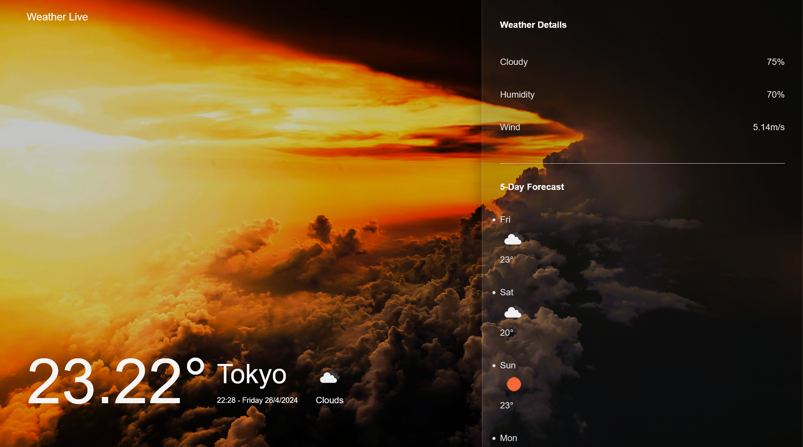

Weather App:

     This project is a weather app that displays current weather conditions and a 5-day forecast for a selected city. It utilizes the OpenWeatherMap API to fetch weather data and Leaflet.js for interactive map display.

Features:

- Current Weather Display: Shows temperature, weather conditions, humidity, wind speed, and cloudiness for the selected city.
- Dynamic Backgrounds: Background images change based on weather conditions (clear, cloudy, rainy, snowy).
- Interactive Map: The map displays the location of the selected city.
- Responsive Design: The app is designed to work well on various screen sizes, including mobile devices.

Technologies Used:

- HTML/CSS/JavaScript
- OpenWeatherMap API
- Leaflet.js

Screenshots:

